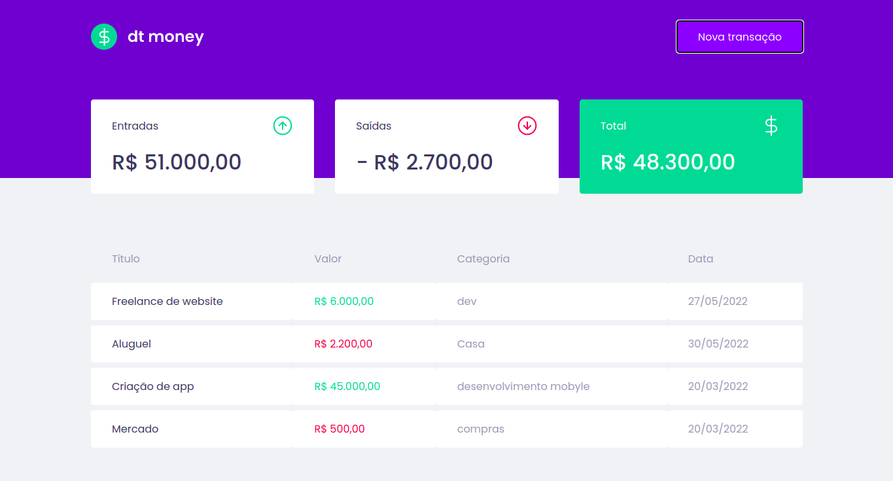

# dtmoney

## Introdução

O dtmoney é um exemplo de uma aplicação financeira criada para ajudar no controle de receitas e despesas. Desenvolvida para pessoas comuns terem acesso a uma ferramenta simples de usar no dia a dia.

## Detalhes técnicos

### Backend

Usando a função **Server** fornecida pela biblioteca **miragejs** criamos uma fake api para uma simples demonstração de funcionamento do dtmoney